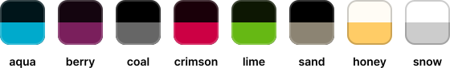

# `klar` by `m_axic`

 

 

**A simplistic, clear theme with multiple color variants for [Onion OS](https://github.com/OnionUI/Onion).**

 

 

---

 

 

---

 

## Screenshots

### Dark Variants

  
  
  
  
  
  

 

### Light Variants

  
  

 

---

## Credits

### Icons

- [Phosphor Icons](https://phosphoricons.com/)
- OnionUI

### Font

- [Inter](https://rsms.me/inter/)
